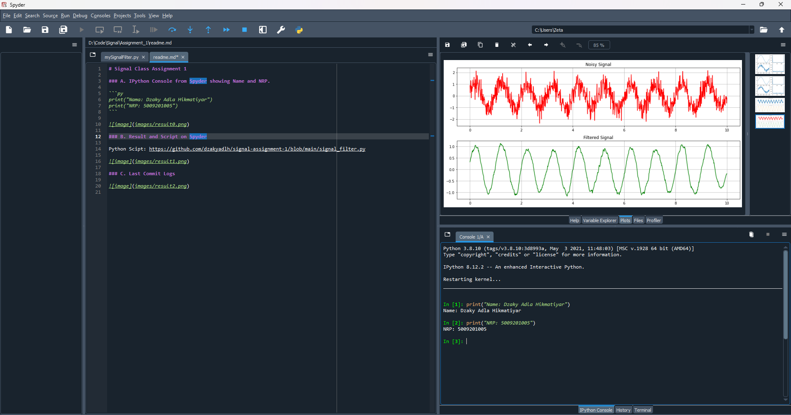
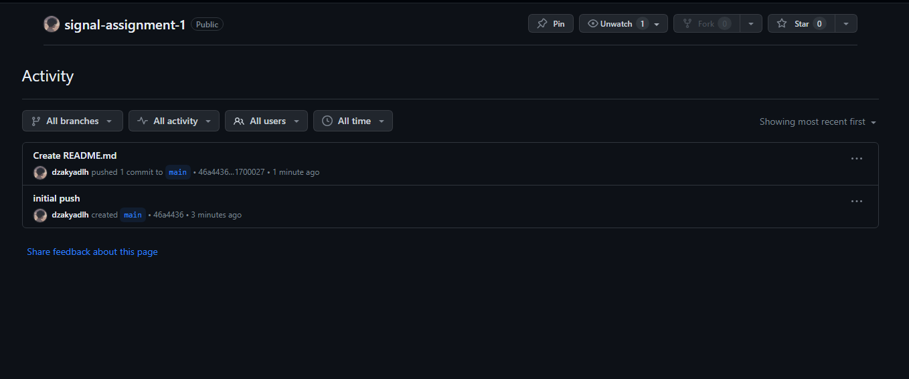

# Signal Class Assigment 1

### A. IPython Console from Spyder showing Name and NRP.

```py
print("Nama: Dzaky Adla Hikmatiyar")
print("NRP: 5009201005")
```


### B. Result and Script on Spyder

Python Scipt: https://github.com/dzakyadlh/tugas-sinyal/blob/main/mySignalFilter.py



### C. Last Commit Logs


